# Deploy docker image to AWS

## Overview
There is a step-by-step guide how to deploy the indicore backtester image in AWS. Please pay attention - usage of the mentioned services of Amazon is not free and you would better to know the costs in advance.

1. Login to AWS Console https://console.aws.amazon.com/
2. Go to Services -> Compute -> ECS  
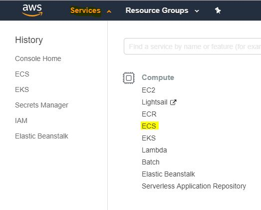
3. Go to Amazon ECS -> Clusters and press "Create Cluster" button  

4. Choose "Networking only" then press "Next Step" button  
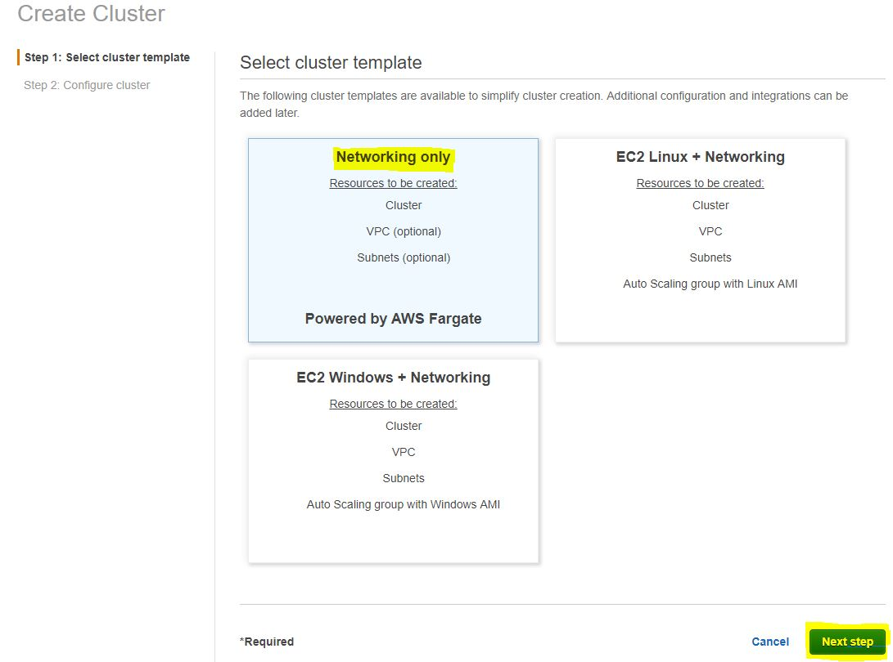
5. Set the cluster name (could be any name) then press "Create" button  
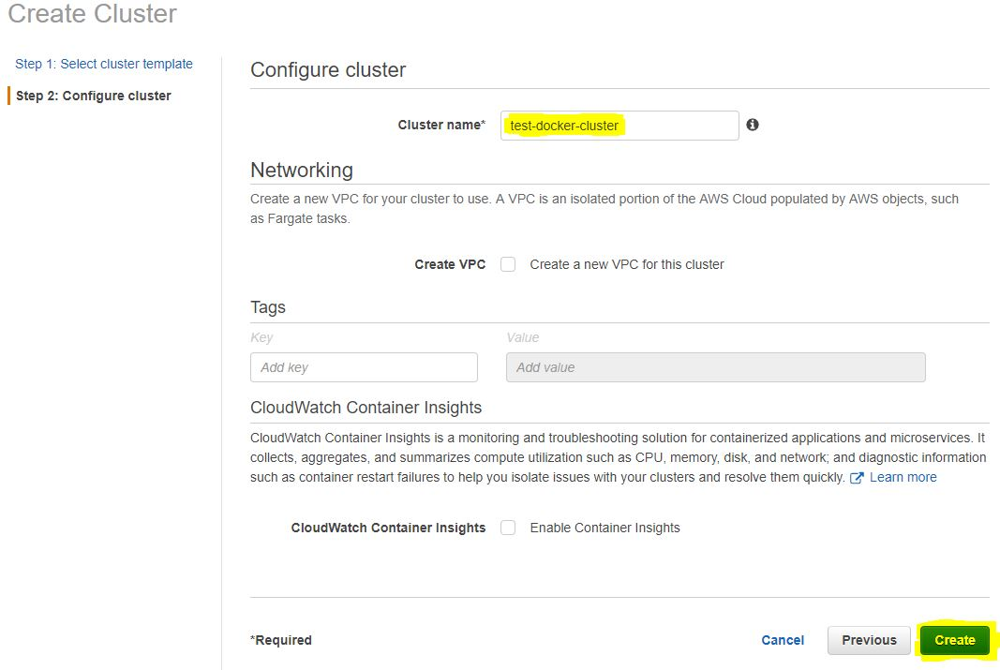
6. Wait until the cluster is created, then press "View Cluster" button  
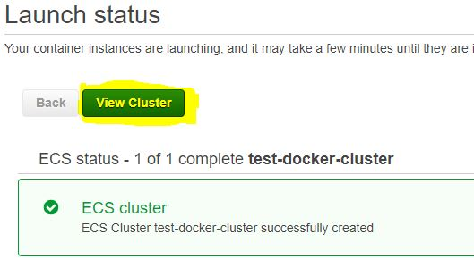
7. Go to Amazon ECS -> Tasks Definitions and press "Create new Task Definition" button  
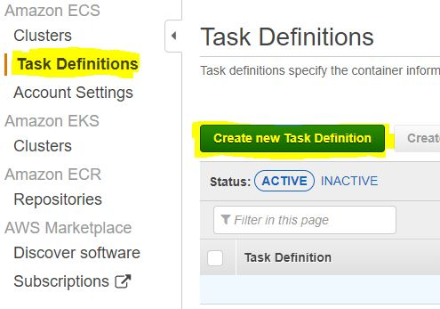
8. Choose "FARGATE" then press "Next Step" button  
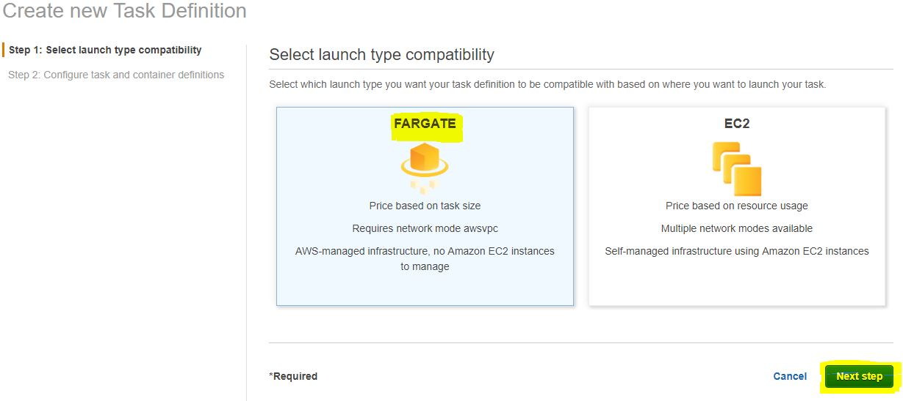
9. Set Task Definition name (could be any name)
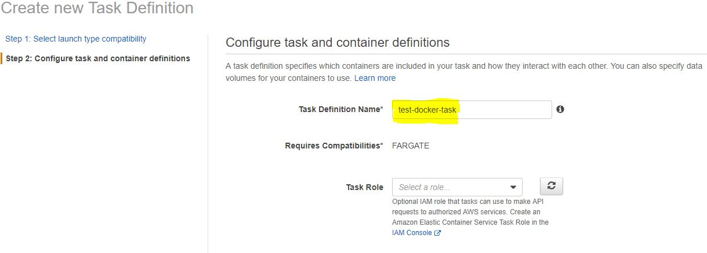
10. Set Task memory and Task CPU then press "Add container" button
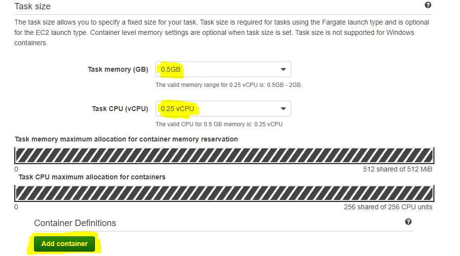
11. Set the container name (could be any name), Image docker.io/gehtsoft/backtestutils and Port mappings 80  
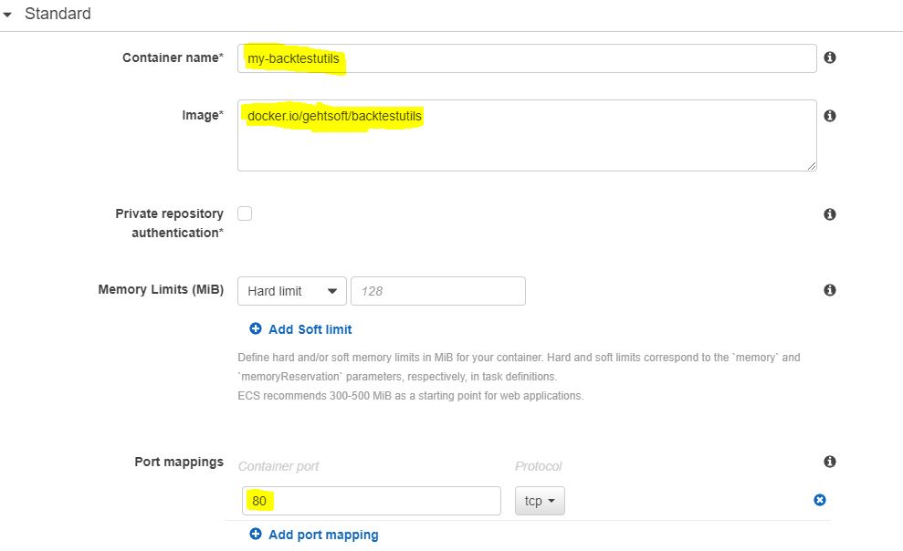
12. Set any other parameters if needed
13. Press "Add" button  
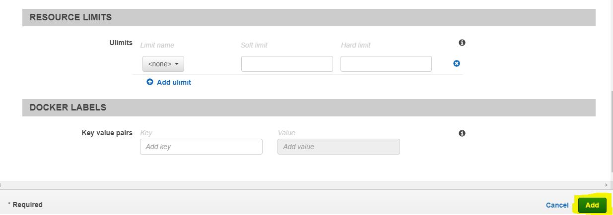
14. Press "Create" button  
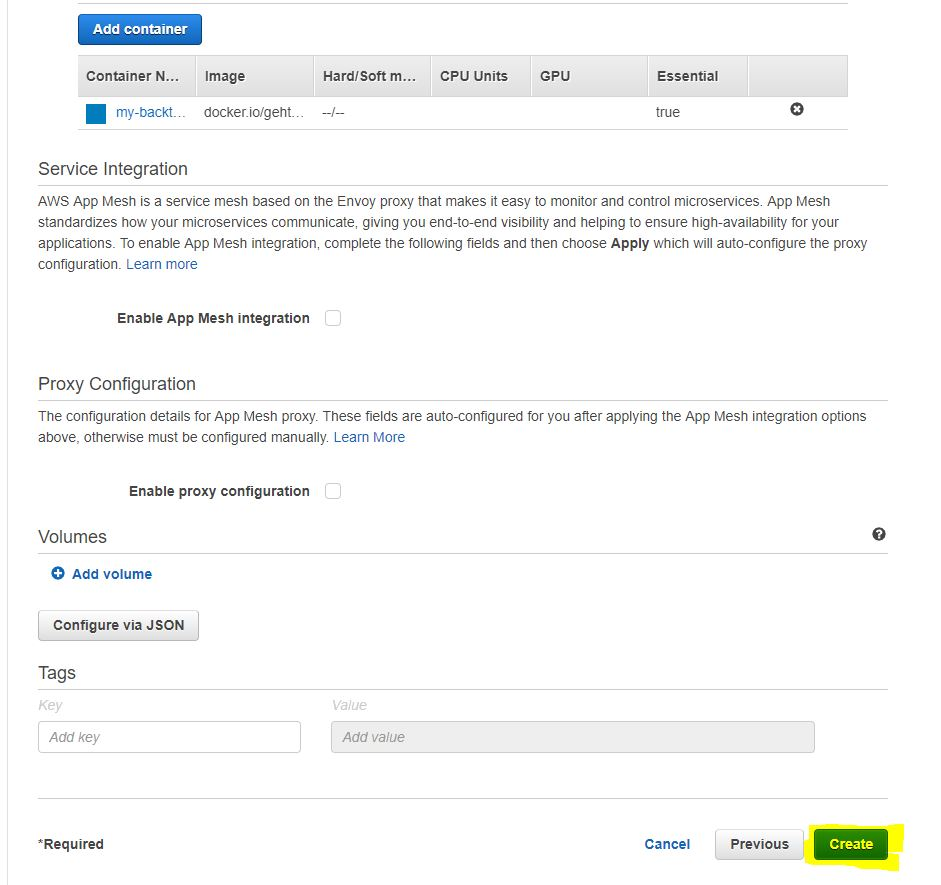
15. Press "View task definition" button  
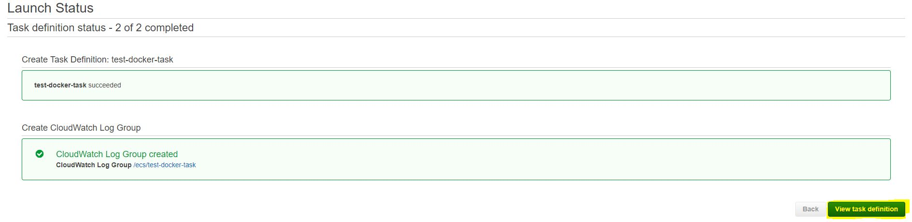
16. Go to Amazon ECS -> Clusters and choose the cluster created at step 5  
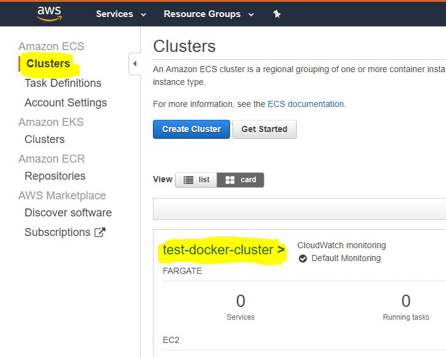
17. Choose "Tasks" tab then press "Run new Task" button  
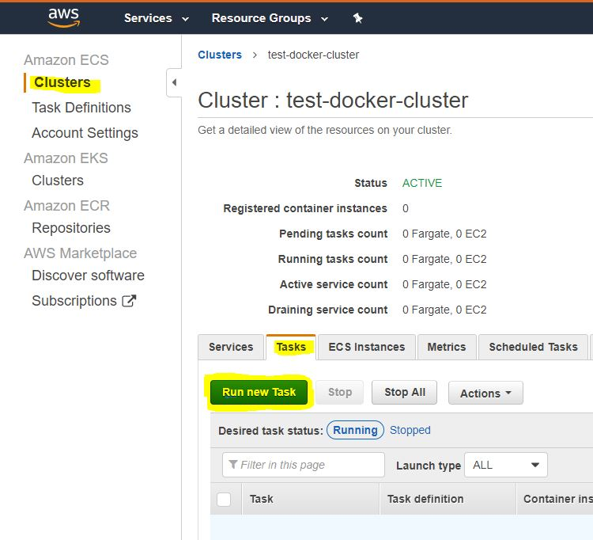
18. Choose Launch type - FARGATE, select the task from the step 14 in Task definition field, select the cluster from the step 5 in Cluster field  
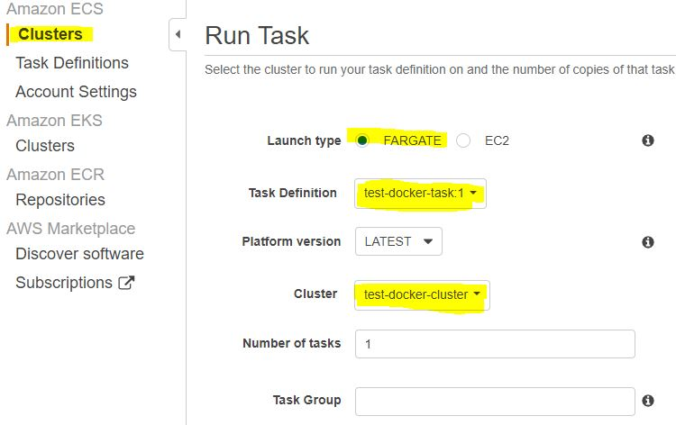
19. Choose Cluster VPC and Subnets, then press "Edit" button in Security groups
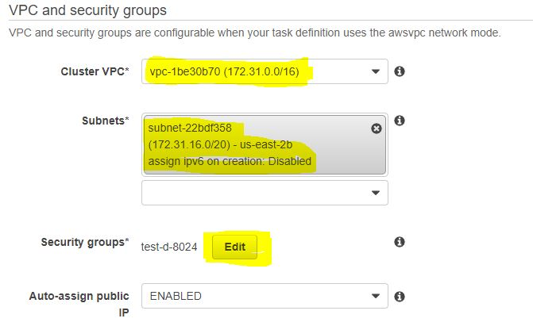
20. Set Security group name (may be any name), select Type - All traffic, then press "Save" button  
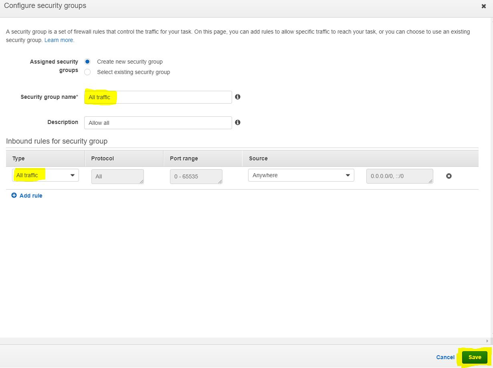
21. Press "Run Task" button
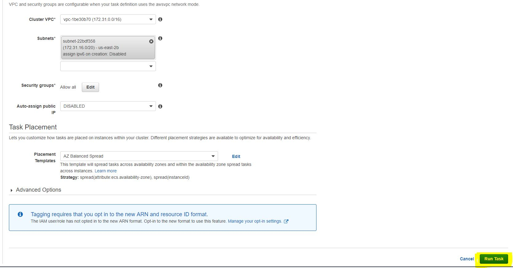
22. Wait till Last status changes to "RUNNING" then press task ID
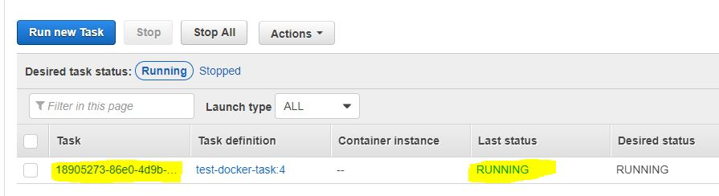
23. Remember Public IP
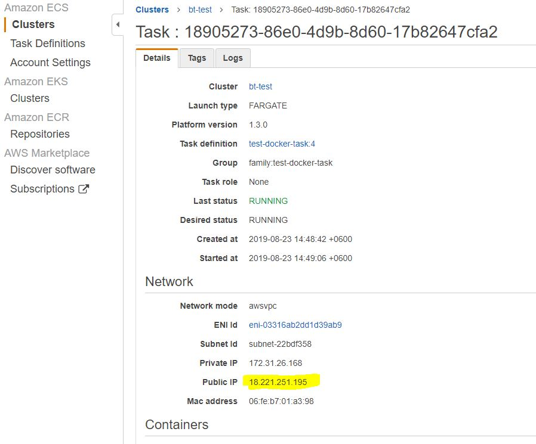
24. BacktestUtils REST API is available at the address from the step 23 on port 80
