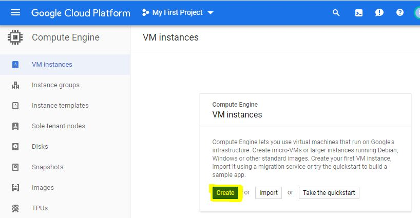
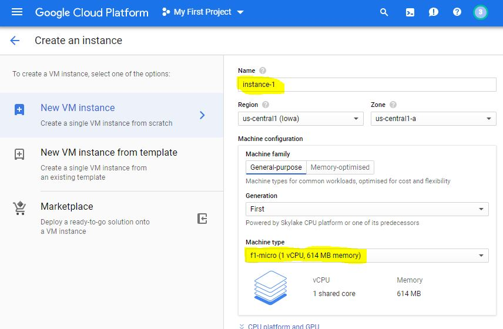
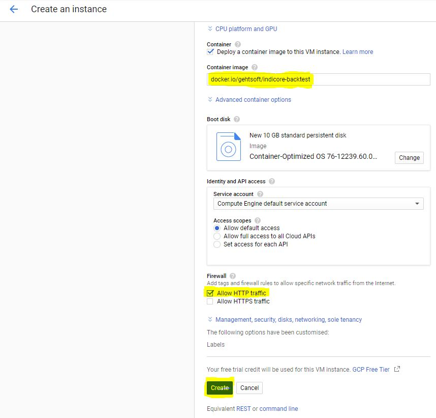
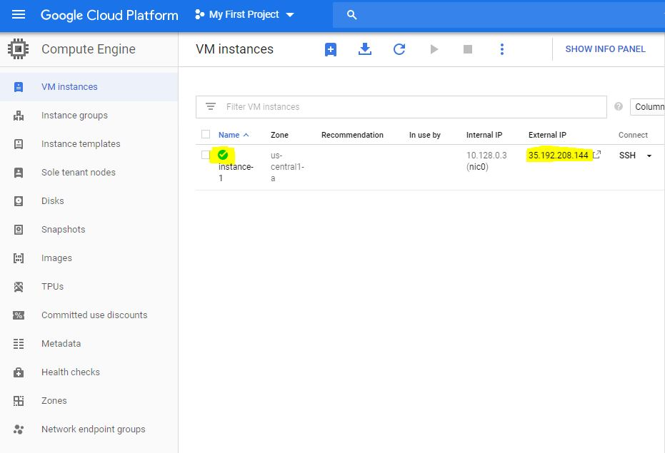

# Deploy docker image to Google Cloud

1. Login to Google Cloud Console https://console.cloud.google.com/compute/instances
2. Press "Create" button  

3. Set Name, Machine type (f1-micro is enough)  

4. Choose "Deploy a container image to this VM instance", enter Container image - docker.io/gehtsoft/backtestutils, choose "Allow HTTP traffic" and press "Create" button  

5. Wait till VM instance will be created, and state changed to "Running". BacktestUtils rest deployed to External IP on port 80  

