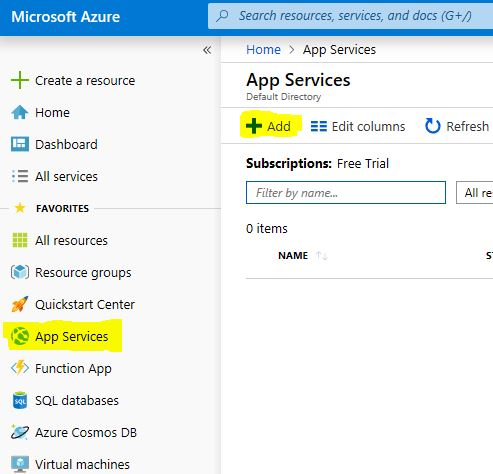
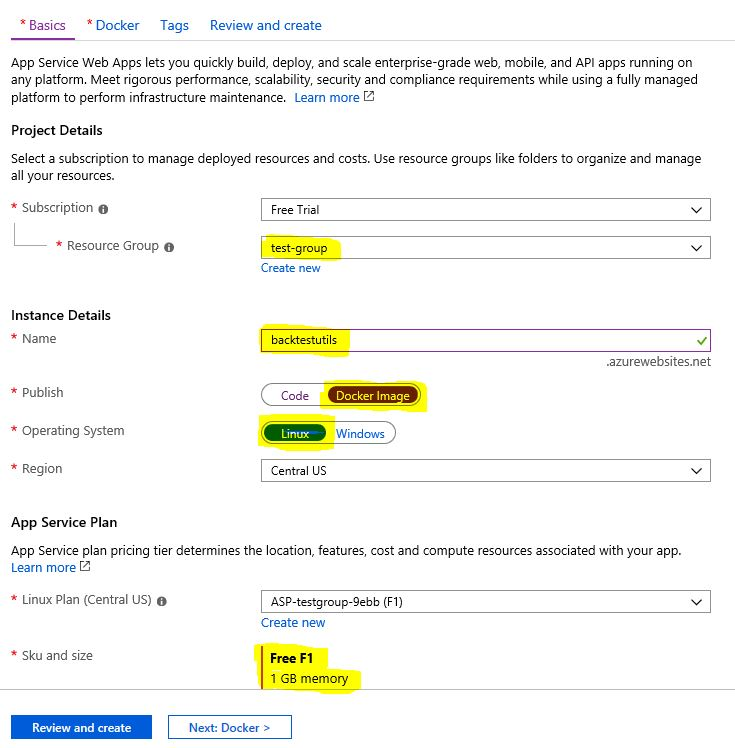
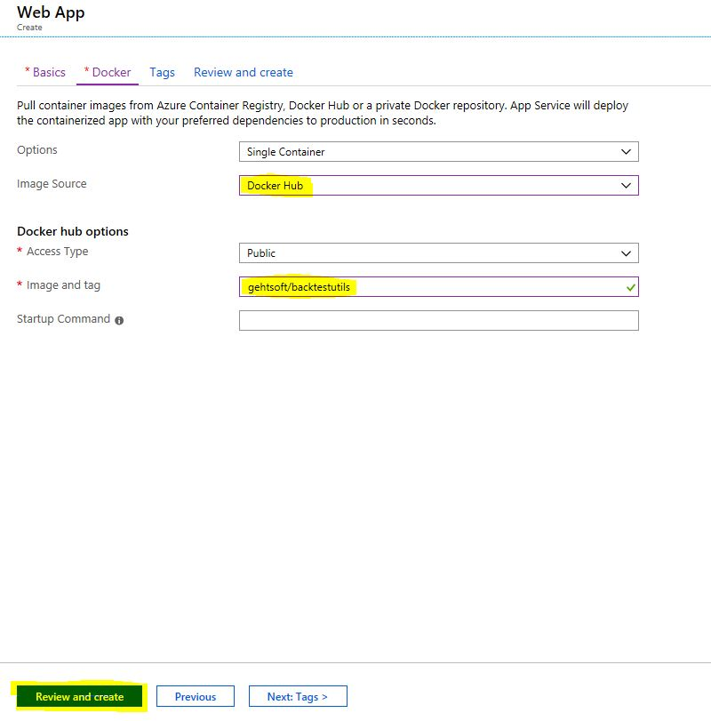
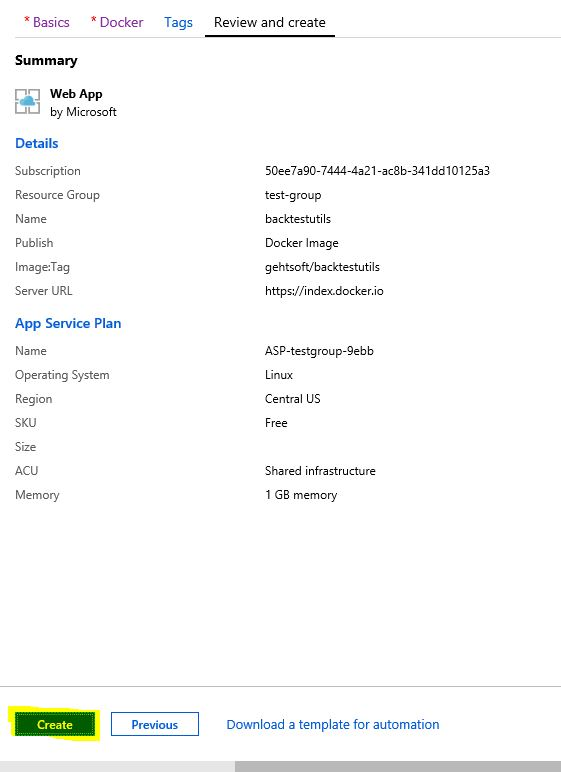
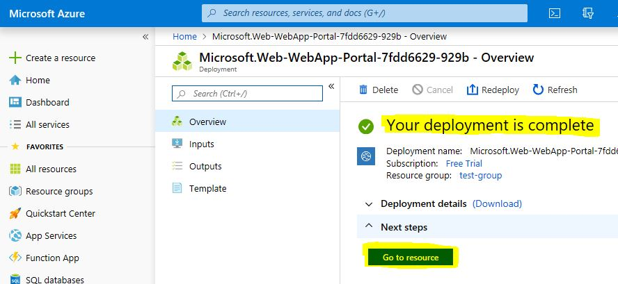
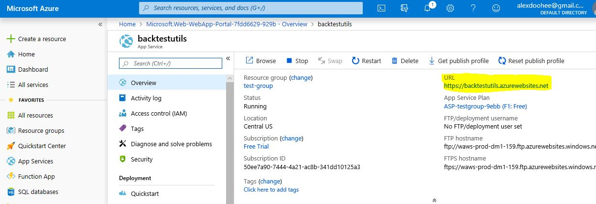

# Deploy docker image to Microsoft Azure

There is a step-by-step guide how to deploy the indicore backtester image in Microsoft Azure. Please pay attention - usage of the mentioned services of Microsoft is not free and you would better to know the costs in advance.

1. Login to Microsoft Azure https://portal.azure.com
2. Go to App Services then press "Add" button  

3. Set Subscription, Resource Group (create new if neccessary), Name, Publish - Docker Image, Operating system - Linux, App Service Plan (F1 is enough), then press "Next: Docker" button  

4. Choose Image Source - Docker Hub, Image and tag - gehtsoft/indicore-backtest, then press "Review and create" button  

5. Press "Create" button  

6. Wait till deployment complete and press "Go to resource" button

7. BacktestUtils REST API is available at the URL on port 80  

